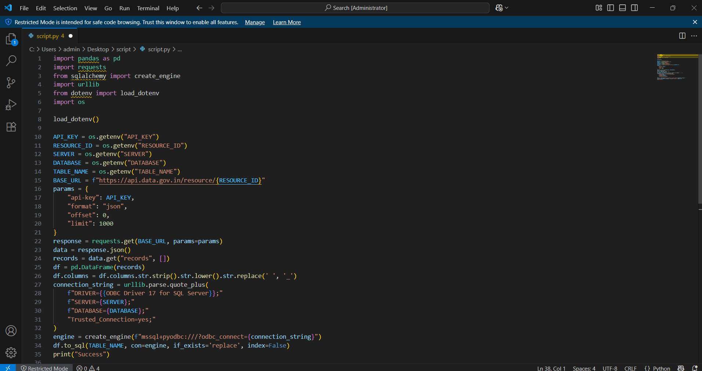
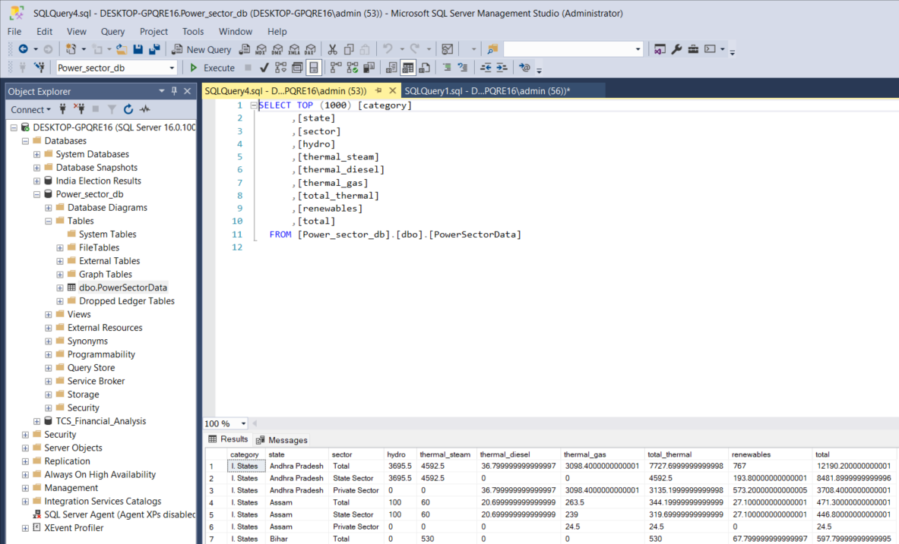

# GOVT OPEN DATA POWER SECTOR DASHBOARD

## Overview
This project presents a Power BI dashboard developed for **Nationwide power and thermal plants** to uncover insights around **carbon emissions**, **PVM analysis**, **water usage**, **revenue trends**, and **operational efficiency**. The goal is to support sustainability and performance improvements across power plants.

 **[View Live Dashboard](https://app.powerbi.com/view?r=eyJrIjoiNTMyZmMyNzctMmNkYS00ZjFjLWExY2EtOTM5ZTVkNDc0ZjhlIiwidCI6ImRiMDlkOWRmLWM4NmQtNDAyMy05YzY2LWM2M2JlMWJkY2U4ZCJ9)**

---

## Problem Statement

- Visualize and analyze power generation trends across energy types.
- Assess carbon emissions per plant to support environmental strategies.
- Identify operational inefficiencies and improvement areas via PVM analysis.

---

## Data Acquisition

- Generated a personal API key from the [Government Open Data Portal](https://data.gov.in).
- Used a custom Python script to fetch data through the API, clean it using `pandas`, and load it into a **SQL Server** database using `SQLAlchemy`.
- Verified successful data ingestion using both script logs and SQL Server results.

### 

- 
- 
- 
---

---

## Data Modeling

---

##  Insights & Recommendations

###  Key Metrics

| Metric                    | Value               |
|---------------------------|---------------------|
| **Sales**                 | ₹119.31 billion     |
| **Total Operational Cost**| ₹94.05 billion      |
| **Transmission Load**     | 4.02%               |
| **Water Usage per MWh**   | 2.64%               |
| **Revenue per MWh**       | ₹3.60K              |
| **Power Generation/Day**  | 35.27 million MWh   |

---

###  Carbon Emissions vs Power Generation (by Plant)

- Most plants emit **5%–6% carbon per unit**.
- **JSW Neo Energy**, **ONGC Tripura**, and **Rourkela Power Station** generate high energy with moderate emissions.
- **Konark Solar Initiative** has the **lowest carbon footprint**, reflecting its solar foundation.

---

###  Energy Mix in Power Generation

- **Thermal Energy:** 70%
- **Solar Energy:** 27%
- **Hybrid Energy:** 3%

>  Thermal dominates, but solar energy shows strong adoption.

---

###  Capacity & Load Insights

- **Plant Load Factor:** Ranges from **88% to 91%**, very stable.
- **Capacity Utilization:** Stable around **60–70%**, peaking at **80%**.
-  Indicates **high efficiency with room for improvement**.

---

##  Visual Analysis

###  Carbon Emission Analysis  

###  GP Variance Analysis  

###  Water Usage and Revenue Insights  

###  PVM Analysis  

---

## Tools & Technologies Used

- **Power BI** – Interactive dashboards and KPIs  
- **Power Query** – Data transformation and preparation  
- **DAX** – Custom metrics and data insights  
- **SQL Server** – Data storage and querying  
- **Python** – API-based data extraction and SQL loading  
- **Microsoft PowerPoint** – Stakeholder presentation

---

## 🙏 Thank You for Reading

**Author**: Chaitanya S  
📧 Email: [sudhakarchaitanya8@gmail.com](mailto:sudhakarchaitanya8@gmail.com)

