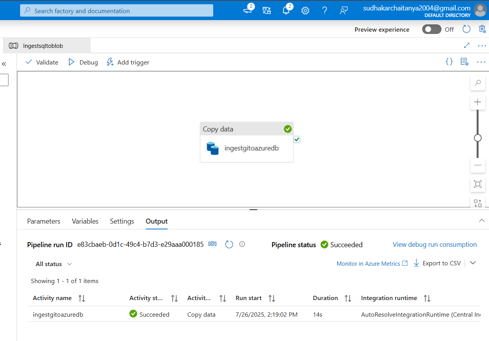
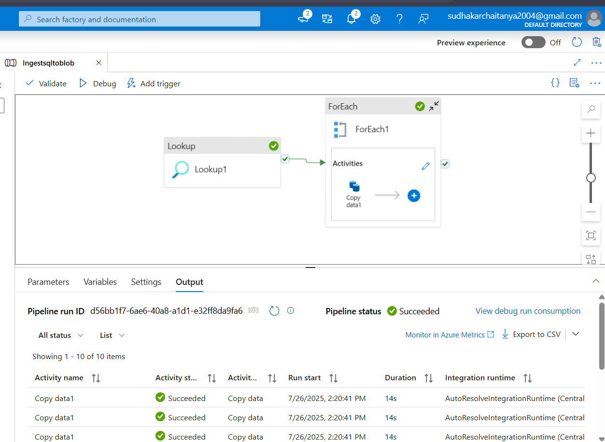
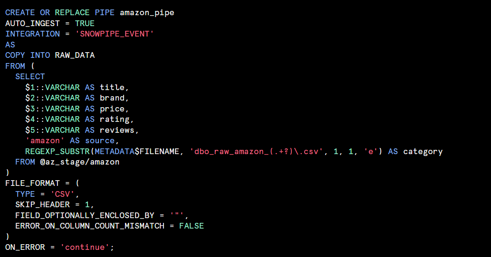
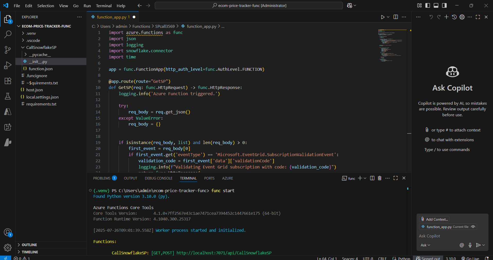
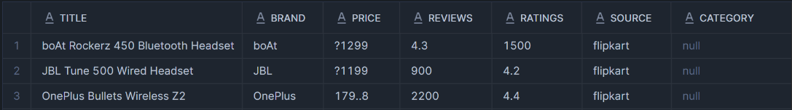
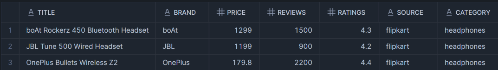
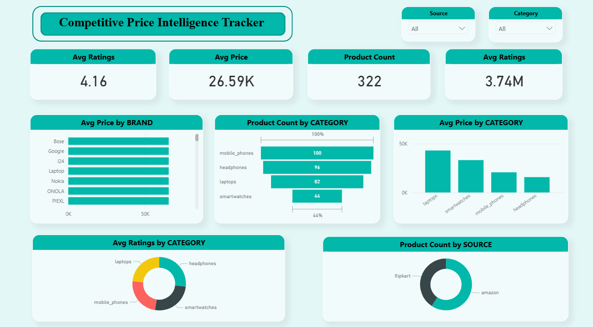

#  Competitive Pricing Intelligence Tracker

An end-to-end ETL pipeline for tracking competitive pricing across e-commerce platforms (Amazon & Flipkart). The project includes automated scraping, dynamic data movement through Azure, transformation in Snowflake, and interactive insights using Power BI.

---

##  EXTRACT

This stage involves collecting raw product pricing data and pushing it into the raw Snowflake layer.

###  1. Web Scraping

- A Python script scrapes pricing and metadata of products from Amazon and Flipkart.
- The scraped `.csv` files are uploaded to a public GitHub repo for continuous access.

###  2. Azure Data Factory Pipelines

Two dynamic and fully parameterized ADF pipelines handle the ETL flow.

#### Pipeline 1: GitHub -> Azure SQL



- Uses a Web copy activity to ingest raw `.csv` files from GitHub.
- Data is written to staging tables in Azure SQL with dynamic naming.

- Sink Table: `raw_amazon_Smart Watches`

**Parameters used:**

```sql
@concat('Data%20Scraping/', pipeline().parameters.platform, '/', pipeline().parameters.platform, '_', replace(pipeline().parameters.category, ' ', '_'), '.csv')

@concat('raw_', pipeline().parameters.platform, '_', pipeline().parameters.category)
```

####  Pipeline 2: Azure SQL -> Azure Data Lake



- Uses a ForEach activity to iterate over staging tables.
- Dynamically writes `.csv` files to the appropriate e-commerce folder (amazon/ or flipkart/) in ADLS.

**Dynamic Parameters:**

```sql
Schema Name: @item().table_schema

Table Name: @item().table_name

Directory: @if(contains(item().TABLE_NAME, 'amazon'), 'amazon', 'flipkart')

File Name: @concat(item().TABLE_SCHEMA, '_', item().TABLE_NAME, '.csv')
```

###  3. Snowpipe - Incremental Load

- An Event Grid in Azure listens for file uploads to ADLS.
- Triggers Snowpipe which ingests the newly added `.csv` into the Snowflake raw layer automatically.




---

##  TRANSFORM

This stage cleans, standardizes, and enriches the raw product data.

###  1. Azure Functions (Python)

- A Python-based Azure Function (HTTP triggered) is deployed to call the Snowflake stored procedure.
- The stored procedure is called by automatic logic using Azure Event Grid notification.




###  2. Stored Procedure in Snowflake

Handles data transformation logic such as:

- Category standardization  
- Null handling  
- Type casting and renaming  
- Writes cleaned output to a structured Data Mart

### Before vs After (Raw -> Transformed):

| Raw Data | Transformed Data |
|----------|------------------|
|  |  |

---

##  LOAD

This stage prepares final outputs for business consumption.

###  Data Mart

- The cleaned and transformed data is stored in a dimensional format.
- Supports efficient querying for BI tools.

###  Power BI Dashboard

- Directly connected to the Snowflake Data Mart.
- Offers insights such as:
  - Price comparisons across platforms
  - Category-level trends
  




---


